# Flujo de Aprobaciones con Firma Digital Concatenada
 
Prueba Técnica Fullstack Senior — AVAL Asset Management (Grupo Aval).
 
Aplicación completa de aprobación de solicitudes de compra con firma digital concatenada (hash chain), verificación por OTP y generación de evidencia en PDF. Backend 100% serverless en AWS; frontend en React con arquitectura de microfrontends (Module Federation).
 
---
 
## 🌐 En vivo
 
| | URL |
|---|---|
| **Frontend** | https://d17ikmoptxcbe1.cloudfront.net |
| **Backend (API)** | https://l77ui6z9f2.execute-api.us-east-1.amazonaws.com/Prod |
| **Health check** | https://l77ui6z9f2.execute-api.us-east-1.amazonaws.com/Prod/api/v1/health |
 
---
 
## 📂 Estructura del repositorio
 
```
.
├── webAvalBack/          Backend — AWS Lambda, API Gateway, DynamoDB, S3
│   └── README.md         Arquitectura, API, decisiones, testing, despliegue
│
├── webAvalFront/          Frontend — React + Module Federation
│   ├── README.md          Arquitectura, vistas, testing, despliegue
│   └── aprobador/         Microfrontend remoto (vista de aprobación)
│
└── openapi.yaml             Contrato OpenAPI de la API (para importar en Swagger Editor / Postman)
```
 
Cada carpeta principal (`webAvalBack/`, `webAvalFront/`) tiene su propio README con el detalle completo: arquitectura, decisiones de diseño, cómo instalar y correr el proyecto, cómo desplegarlo, cobertura de tests, y una sección honesta de los problemas reales que aparecieron durante el desarrollo y cómo se resolvieron. Este documento es solo el punto de entrada.
 
---
 
## 🧭 Qué hace la aplicación
 
Un solicitante crea una solicitud de compra (título, descripción, monto) y elige 3 aprobadores con roles distintos. Cada aprobador recibe un link único, se verifica con un código de un solo uso (OTP), y decide si aprueba o rechaza. Cada aprobación queda encadenada criptográficamente con la anterior (hash chain), de forma que cualquier alteración posterior de los datos es detectable. Cuando los 3 aprobadores firman, se genera automáticamente un PDF de evidencia con el detalle completo y las firmas, almacenado de forma privada y accesible solo mediante una URL temporal.
 
---
 
## 🛠️ Resumen técnico
 
| | Backend | Frontend |
|---|---|---|
| Stack | Node.js, AWS Lambda, API Gateway, DynamoDB, S3, SAM | React 19, webpack 5 + Module Federation |
| Arquitectura | Por capas (`domain` / `application` / `infrastructure` / `handlers`), dominio aislado de AWS | Host + remote independientes, comunicados en tiempo de ejecución |
| Seguridad | Hash chain SHA-256, OTP con límites de intentos/generaciones, token de firma de un solo uso, TransactWriteCommand para atomicidad | — |
| Testing | Jest — 101 tests, cobertura ≥76% en las 4 métricas | Jest + React Testing Library — 20 tests, cobertura ≥72% en ambos proyectos |
| Despliegue | SAM (CloudFormation) | S3 + CloudFront (SAM) |
 
---
 
## 📸 Capturas de pantalla
 
**Crear solicitud**
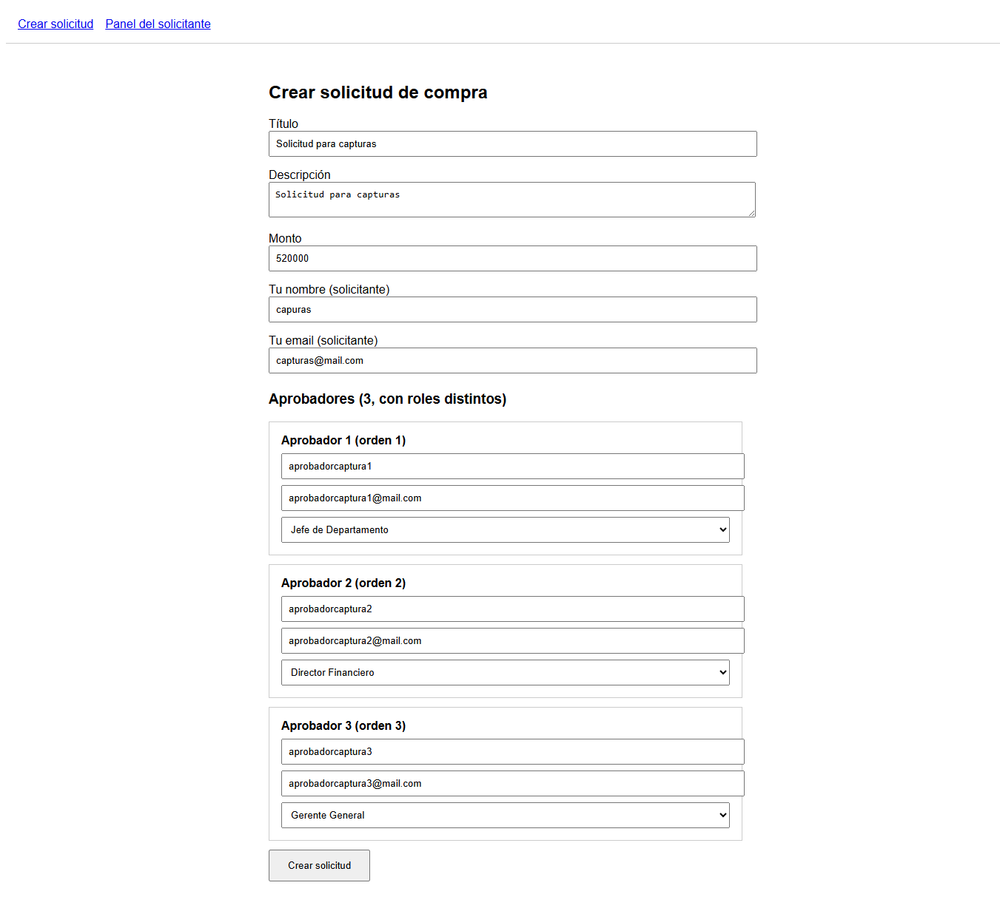
 
**Solicitud creada**
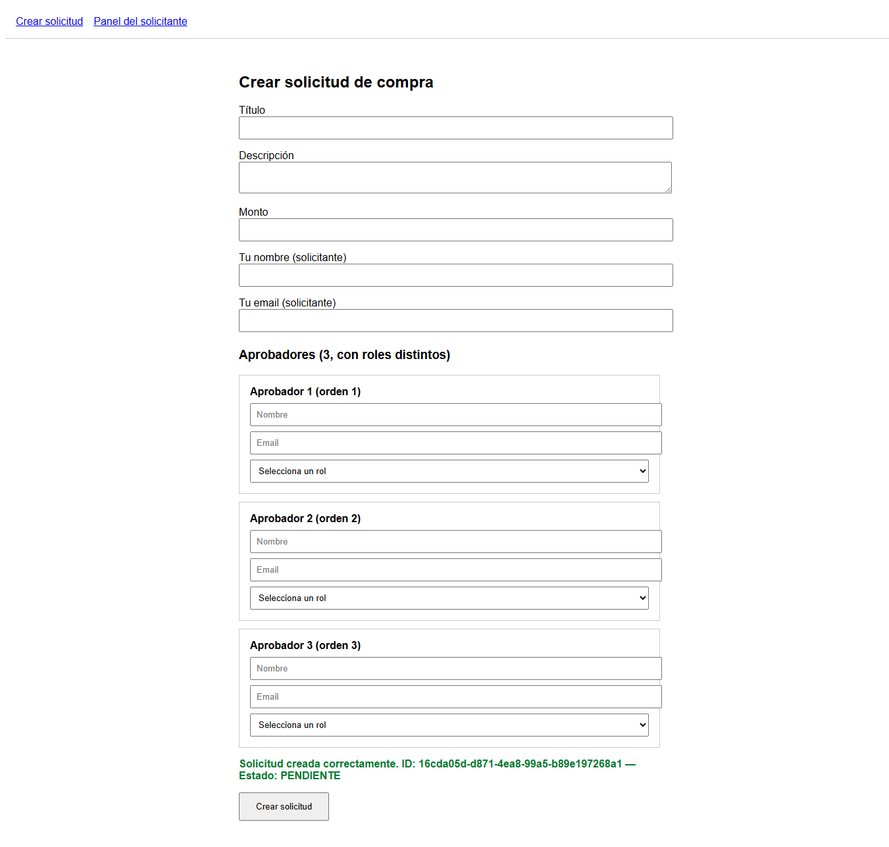
 
**Vista del aprobador 1 — formulario**
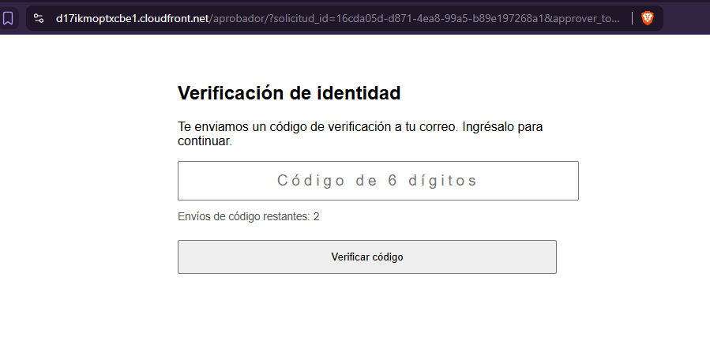
 
**Vista del aprobador 1 — código OTP**
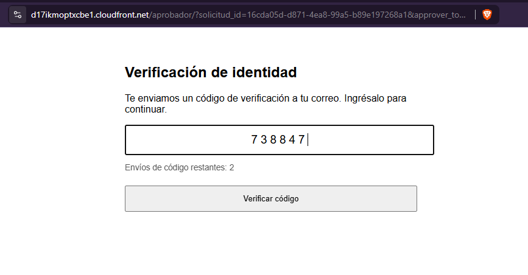
 
**Vista del aprobador 1 — estado de la solicitud**
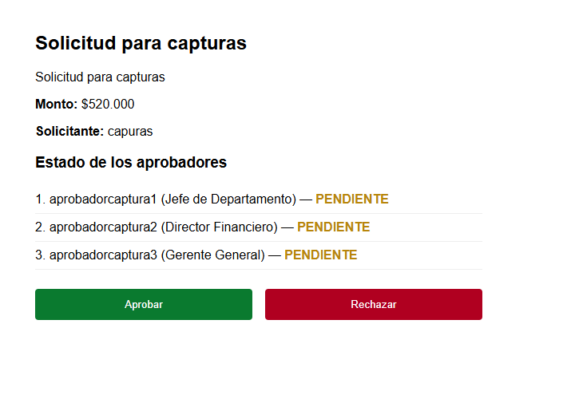
 
**Vista del aprobador 1 — firma registrada**
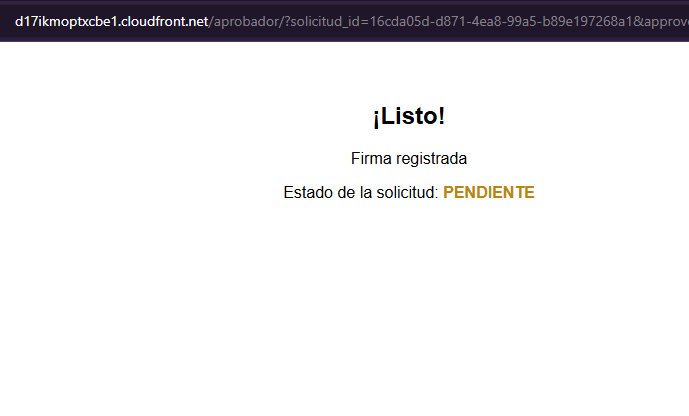
 
**Vista del aprobador 2 — formulario**
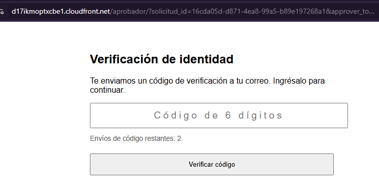
 
**Vista del aprobador 2 — código OTP**
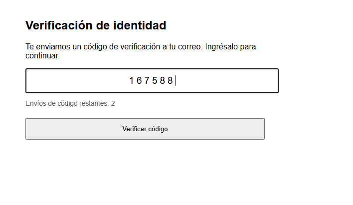
 
**Vista del aprobador 2 — estado de la solicitud**
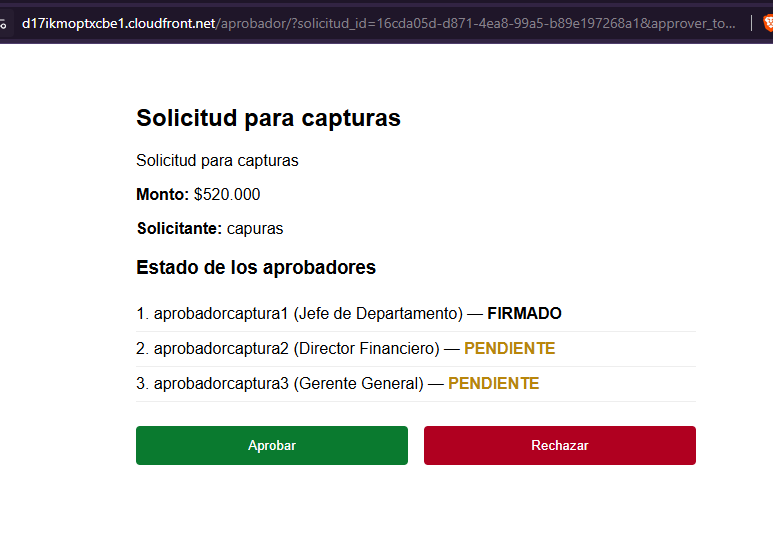
 
**Vista del aprobador 2 — firma registrada**
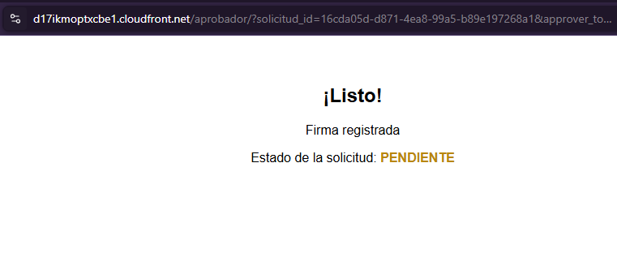
 
**Vista del aprobador 3 — código OTP**
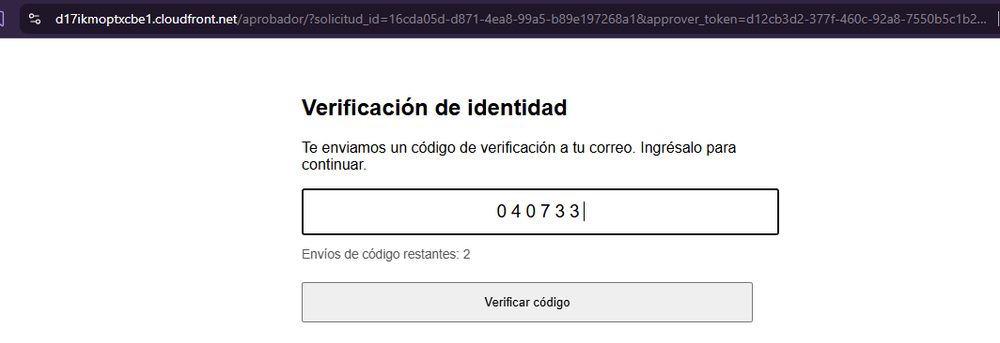
 
**Vista del aprobador 3 — estado de la solicitud**
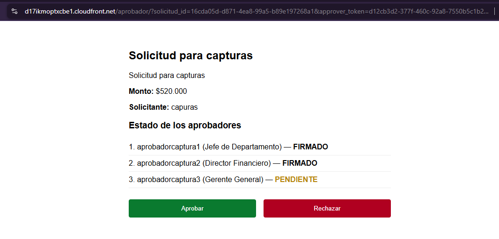
 
**Vista del aprobador 3 — firma registrada (solicitud completada)**
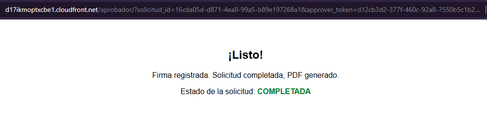
 
**Panel del solicitante**
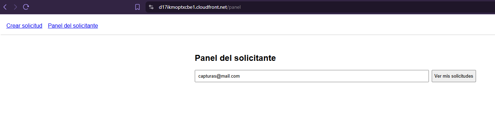
 
**Consulta en el panel del solicitante**
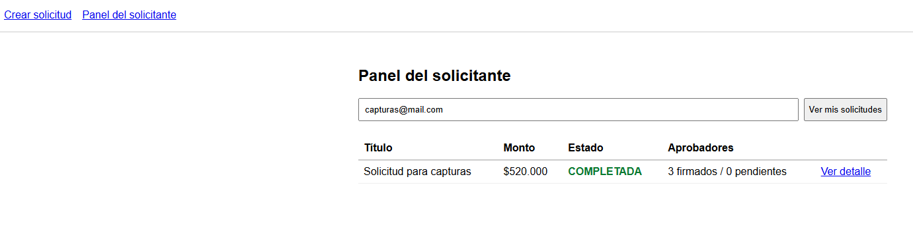
 
**Detalle desde el panel del solicitante**
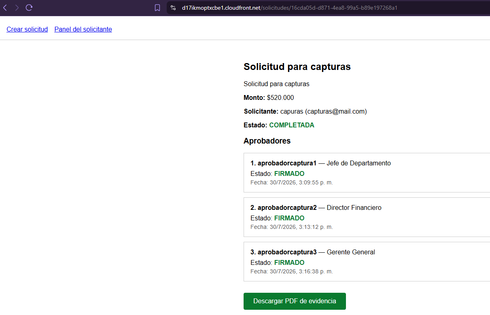
 
**PDF de evidencia generado**
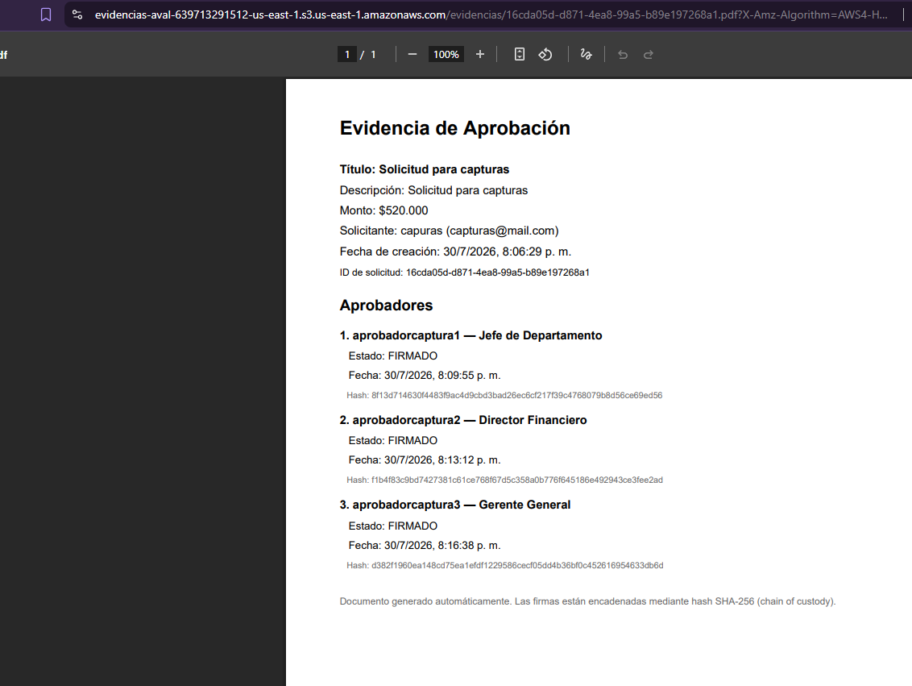
 
---
 
## 📖 Dónde seguir leyendo
 
- **[`webAvalBack/README.md`](./webAvalBack/README.md)** — la documentación completa del backend: los 9 endpoints, el modelo de datos, cómo se implementó la firma concatenada, las decisiones de seguridad, cómo correr los tests, y los problemas reales que se fueron encontrando y corrigiendo por el camino.
- **[`webAvalFront/README.md`](./webAvalFront/README.md)** — lo mismo para el frontend: por qué se dividió en host y remote, las vistas, el testing, el despliegue, y una lista honesta de los tropiezos de configuración (Babel, Module Federation, CORS) que costó bastante diagnosticar.
- **[`openapi.yaml`](./openapi.yaml)** — el contrato de la API en formato OpenAPI, listo para importar en Swagger Editor o Postman.